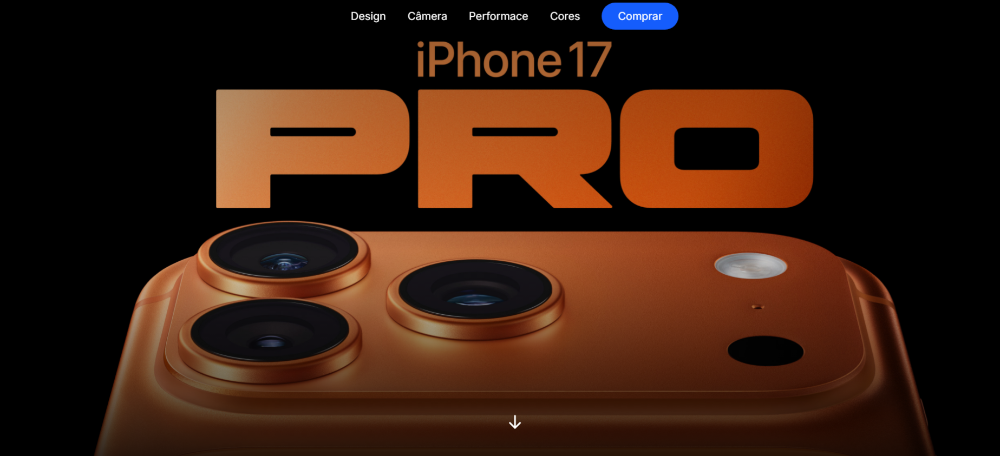
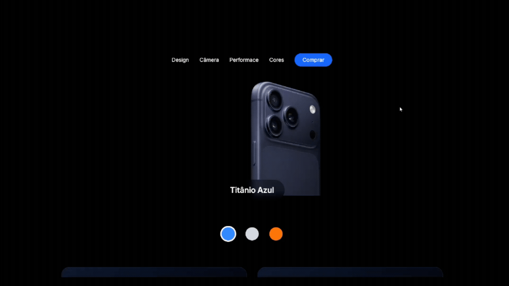

# 📱 iPhone 17 Pro Landing Page

Landing page moderna inspirada no iPhone 17 Pro, desenvolvida com foco em design sofisticado, responsividade e experiência do usuário.

<br>

## 🚀 Funcionalidades

* 📱 Design totalmente responsivo (mobile, tablet e desktop)
* 🎯 Interface moderna inspirada em páginas de produtos
* ⚡ Componentização com React
* 🎬 Animações e transições suaves
* 🖱️ Botões interativos


## 🛠️ Tecnologias utilizadas

<p>
  
  
  
  
</p>

<br>

## 📸 Preview - (Imagem)



<br>

## 🎬  Preview - (Gif)




## 🌐 Acesse o projeto

 https://iphone17-landing-dev.netlify.app/
 

## 📂 Como rodar o projeto

```bash
# Clone o repositório
git clone https://github.com/kiaraengineer-dev/iphone-17-react-tailwind.git

# Acesse a pasta
cd iphone-17-react-tailwind

# Instale as dependências
npm install

# Rode o projeto
npm run dev
